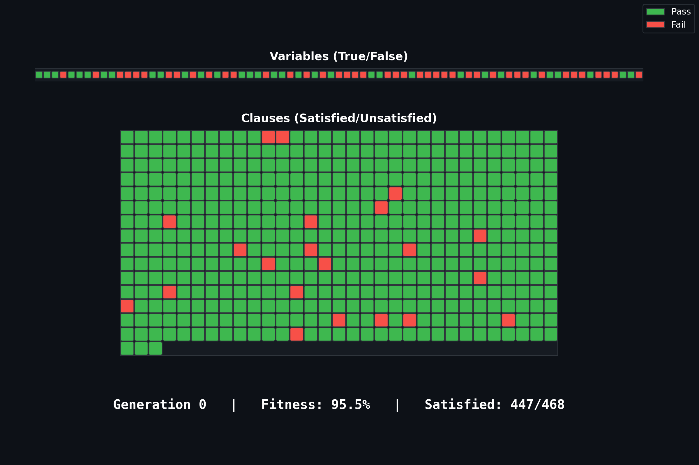
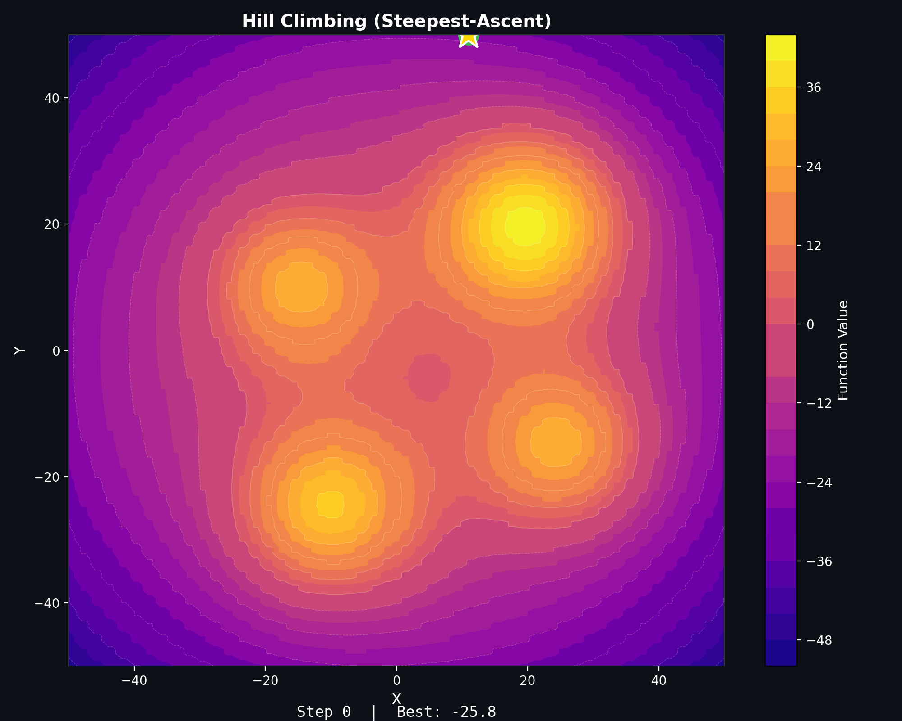
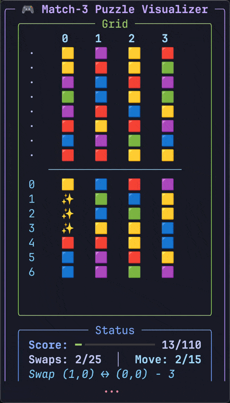

# Artificial Intelligence Projects

A collection of AI and optimization algorithm implementations.

---

### [Chess AI](src/chess_ai/README.md)
Chess engine with minimax alpha-beta pruning

  

---

### [Evolutionary Algorithms](src/evolutionary/README.md)
(μ + λ) EA for Boolean Satisfiability

  

---

### [Hill Climber](src/hill_climber/README.md)
Local search optimization algorithms

  

---

### [Match-3 Solver](src/match3_solver/README.md)
AI solver for match-3 puzzles

  

---

## License

MIT License. See [LICENSE](LICENSE) for details.
