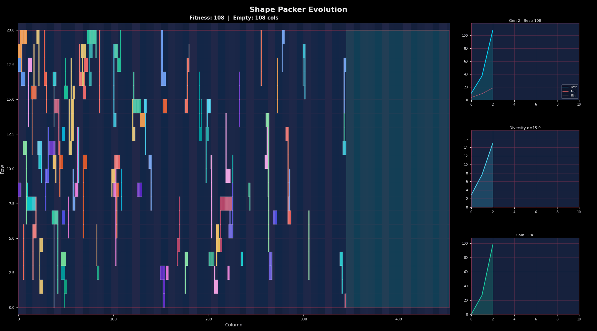

# Artificial Intelligence Algorithms

A collection of AI and optimization algorithms implemented in Python and C++.

## Modules

### Chess AI
Minimax chess engine with alpha-beta pruning (C++).

<p align="center">
  
</p>

```bash
cd src/chess_ai && make && ./chess_ai
```

[Documentation](src/chess_ai/README.md)

---

### Shape Packer
Evolutionary algorithm for 2D shape packing optimization.

<p align="center">
  
</p>

```bash
cd src && python -m run shape-pack -i shape_packer/input/input-2.txt -v
```

[Documentation](src/shape_packer/README.md)

---

### Match-3 Solver
AI solver for match-3 puzzle games.

<p align="center">
  
</p>

[Documentation](src/match3_solver/README.md)

---

### SAT Solver
Evolutionary algorithm for Boolean Satisfiability problems.

<p align="center">
  
</p>

```bash
cd src && python -m run sat -i input.cnf
```

[Documentation](src/sat_solver/README.md)

---

### Hill Climber
Hill climbing algorithms for 2D function optimization.

<p align="center">
  
</p>

```bash
cd src && python -m run hill-climb --function rastrigin
```

[Documentation](src/hill_climber/README.md)

## Unified CLI

Run algorithms using the unified CLI:

```bash
cd src

# Shape packing with visualization
python -m run shape-pack -i shape_packer/input/input-2.txt -v

# SAT solver
python -m run sat -i input.cnf --mu 100 --lambda 50

# Hill climbing
python -m run hill-climb --function sphere --restarts 10
```

## Installation

```bash
pip install -r requirements.txt
```

## License

MIT License
