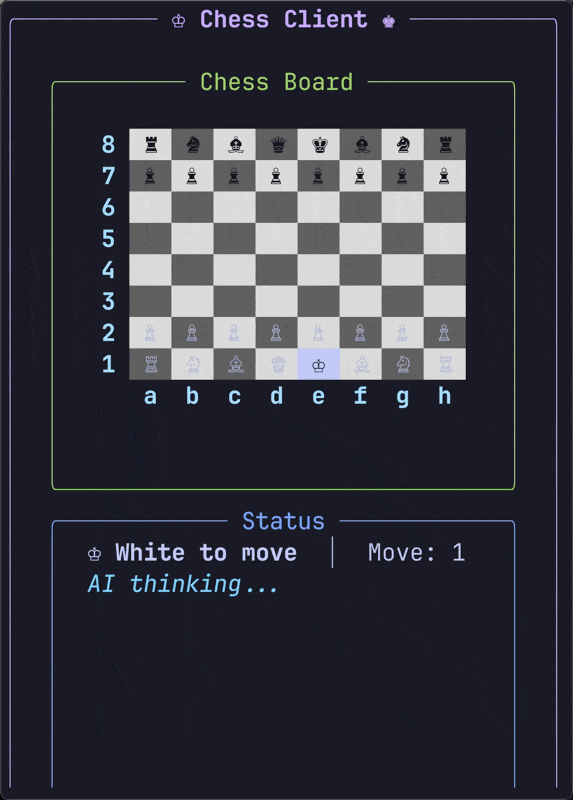

# Chess AI

A chess engine with minimax alpha-beta pruning and an interactive Python terminal client.

<p align="center">
  
</p>

## Features

- **Minimax with Alpha-Beta Pruning** - Efficient game tree search
- **Interactive Terminal UI** - Beautiful board rendering with Rich library
- **Multiple Game Modes** - Human vs AI or AI vs AI
- **Worst Mode** - AI picks the worst possible moves (for training/fun)
- **Complete Chess Rules** - Castling, en passant, pawn promotion
- **FEN Support** - Load any position
- **Time Management** - Adaptive thinking time

## Quick Start

```bash
# Build the C++ engine
make

# Play against the AI
python client.py

# Watch AI vs AI
python client.py --mode ai-ai
```

## Installation

### Requirements

- C++17 compatible compiler (g++, clang++)
- Python 3.8+
- pip

### Build

```bash
# Clone and build
cd chess_ai
make

# Install Python dependencies
pip install rich readchar
```

## Usage

### Python Client

```bash
python client.py [OPTIONS]
```

| Option | Description | Default |
|--------|-------------|---------|
| `--mode {human-ai,ai-ai}` | Game mode | `human-ai` |
| `--color {white,black}` | Your color | `white` |
| `--ai-time SECONDS` | AI thinking time | `5.0` |
| `--delay SECONDS` | Delay between AI moves | `1.5` |
| `--fen FEN_STRING` | Starting position | Standard |
| `--ai-path PATH` | Path to chess_ai binary | `./chess_ai` |
| `--worst` | Enable worst mode | Off |

### Controls

| Key | Action |
|-----|--------|
| Arrow keys | Move cursor |
| Enter | Select piece / Confirm move |
| Escape | Cancel selection |
| f | Flip board |
| q | Quit |

### C++ Engine (Direct)

```bash
./chess_ai [OPTIONS] [FEN]

Options:
  --worst    AI picks worst moves
  -h         Show help

Examples:
  ./chess_ai
  ./chess_ai --worst
  ./chess_ai "rnbqkbnr/pppppppp/8/8/4P3/8/PPPP1PPP/RNBQKBNR b KQkq e3 0 1"
```

## Project Structure

```
chess_ai/
├── client.py           # Python client entry point
├── chess_client/       # Python package
│   ├── board.py        # Rich board rendering
│   ├── game.py         # Game logic & AI communication
│   └── input.py        # Keyboard input handling
├── chess-ai.cpp/h      # Minimax AI with alpha-beta
├── chess-engine.cpp/h  # Move generation engine
├── state.cpp/h         # Board state representation
├── bitboard.cpp/h      # 64-bit bitboard operations
├── action.cpp/h        # Move encoding
├── fen-parser.cpp/h    # FEN notation parser
├── timer.cpp/h         # Time management
├── makefile            # Build configuration
└── test_game.py        # Unit tests
```

## Architecture

```
┌─────────────────┐     FEN string      ┌─────────────────┐
│  Python Client  │ ──────────────────► │   C++ Engine    │
│   (client.py)   │                     │  (chess_ai)     │
│                 │ ◄────────────────── │                 │
│  • Rich UI      │     Best move       │  • Minimax      │
│  • User input   │                     │  • Move gen     │
│  • Game state   │                     │  • Evaluation   │
└─────────────────┘                     └─────────────────┘
```

The Python client handles user interaction and board display. For each AI move, it spawns the C++ engine as a subprocess, passing the current position as a FEN string and receiving the best move.

## Testing

```bash
# Run all tests
python -m pytest test_game.py -v

# Run specific test
python -m pytest test_game.py::TestCastling -v
```

## License

MIT License. See [LICENSE](../../LICENSE) for details.
